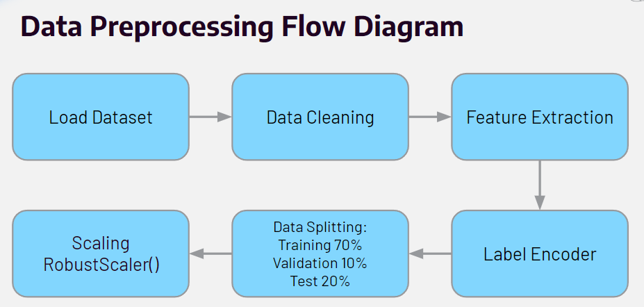

# Music Genre Classification 🎶

## Overview 📃
Our proposed method combines feature extraction techniques with a neural network model to enhance the accuracy and efficiency of music genre classification.

## Data Preprocessing Flow Diagram ➡️

### Steps:
1. **Load Dataset**: Initial step where the audio files (.WAV format) are loaded into the system.
2. **Data Cleaning**: Preprocessing to remove noise and normalize the audio signals.
3. **Feature Extraction**: Extract relevant features such as Mel-Frequency Cepstral Coefficients (MFCCs), Chroma STFT, Spectral Contrast, etc.
4. **Label Encoder**: Encode the genre labels into numerical format.
5. **Data Splitting**: 
   - 70% Training: Utilized for learning patterns and features, ensuring the model is trained on a diverse and comprehensive dataset.
   - 20% Testing: Reserved for evaluating model performance, providing an unbiased assessment of accuracy and generalization.
   - 10% Validation: Used for fine-tuning model parameters and avoiding overfitting.
6. **Scaling (RobustScaler)**: Scale the features to ensure uniformity and enhance model performance.

### Extracted Features:
- **Chroma STFT**: Distribution of pitch classes (C, C#, D, etc.) over time.
- **RMS (Root Mean Square)**: Energy or loudness of the audio.
- **Spectral Centroid**: Brightness of the sound.
- **Spectral Bandwidth**: Range of frequencies.
- **Spectral Rolloff**: Frequency below which most audio's energy is contained.
- **Zero Crossing Rate**: Counts the rate of signal sign changes.
- **Harmony**: Harmonic component of audio.
- **Percussive**: Isolate rhythmic elements like drums.
- **Tempo**: For rhythmic structure and speed insights.
- **MFCC (Mel-Frequency Cepstral Coefficients)**: Capture timbral features of audio.

## Proposed Method 🖥️
### Audio Feature Extraction (AFE)
- **Chroma STFT**: Captures melodic and harmonic content, crucial for genres with complex progressions like jazz (Hu & Ogihara, 2012).
- **MFCCs**: Capture timbral qualities, essential for differentiating genres like rock and classical (Costa et al., 2012).

### Neural Network (NN) Model
- Neural networks effectively learn intricate patterns within audio features (Pelchat and Gelowitz, 2020).
- Combined with feature extraction to enhance music genre classification.

### Training Scenarios
We evaluated our neural network model under three different scenarios to analyze the impact of various techniques on model performance:

1. **Baseline Model**: 
   - No dropout or batch normalization applied.
   - Serves as a reference point for comparison.

2. **Normalized Model**: 
   - Includes batch normalization.
   - Aims to stabilize and accelerate the training process by normalizing the input layer by adjusting and scaling the activations.

3. **Regularized Model**: 
   - Incorporates dropout.
   - Designed to prevent overfitting by randomly setting a fraction of input units to 0 at each update during training time.

## Results 💯

## Contributors 👨‍💻👩‍💻
- **Vladimir Elwin Leonard**
- **Jehoiada Wong**
- **Axel Nino Nakata**
- **Aretha Natalova Wahyudi**
- **Jessica Lynn Wibowo**
- **Hans Robert Gunawan**
- **Darren Hansel Susanto, Tan**

## Course 📖
Speech Recognition - LC01 (COMP6822001)
